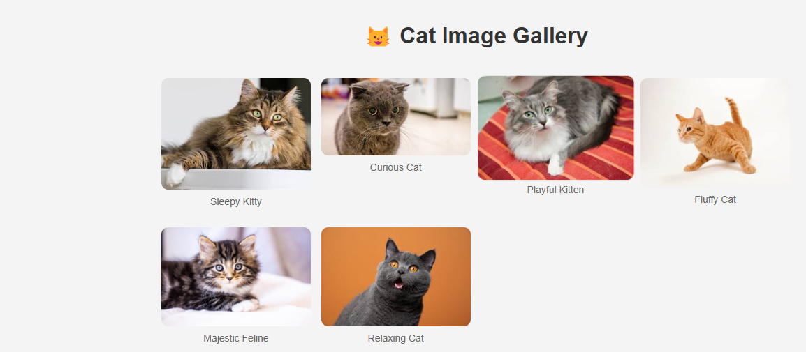
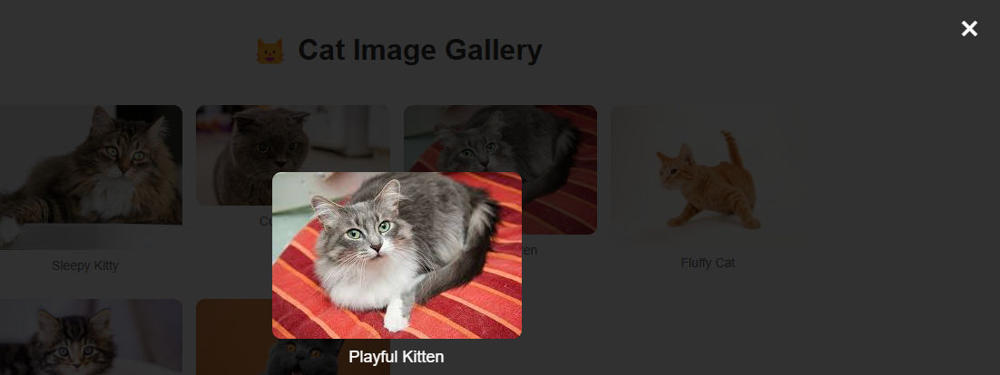

# cats-image-gallery

## 📌 Description
The Cat Image Gallery is a simple and elegant web-based gallery displaying adorable cat images. It features a responsive design, smooth image enlargements using a lightbox effect, and an interactive user experience.

## 🛠 Prerequisites
N/A

## 📋 Criteria
* Responsive gallery layout using CSS Grid
* Lightbox functionality for image enlargements
* Smooth hover effects for images
* Organized and reusable CSS and JavaScript
* Simple and intuitive UI

## 💻 Technologies Used
The application is built with the following technologies:
* HTML
* CSS
*JavaScript

## 🚀 Installation
No installation is required to use the app. It is hosted online and can be accessed via a web browser.

## 📚 Usage
1. Open the gallery in your browser.
2. Click on any cat image to view it in an enlarged lightbox.
3. Click outside the image or on the close button to exit the lightbox.

## 🔗 Live Demo & Repository
Application can be viewed here: 
* [Live](https://yvonnesarah.github.io/cats-image-gallery/)

* [Repository](https://github.com/yvonnesarah/cats-image-gallery)

## 🖼 Screenshot(S)
Below is a preview of Cats Image Gallery:

Below is a preview of Cat Image:

## 👥 Credit
N/A

## 📜 License
This project is open-source. For licensing details, please refer to the LICENSE file in the repository.

## 📬 Contact
You can reach me at 📧 yvonneadedeji.sarah@gmail.com.
